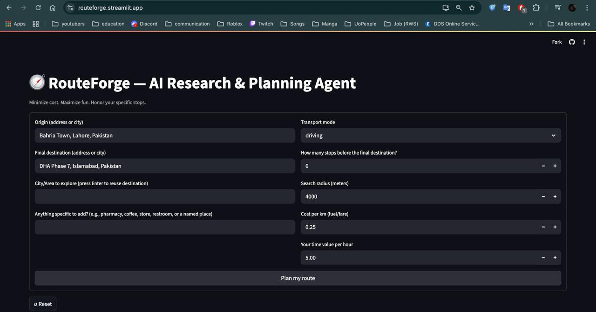

# RouteForge — AI Research & Planning Agent

**RouteForge** is an *AI trip-planning* agent that turns free-form requests into **routable plans**.  
It balances **minimum cost** and **maximum fun**, and it’s tailored for real travel moments when users need **specific stops** on the way (e.g., coffee, restroom, or any explicit request).

***[🔗routeforge](https://routeforge.streamlit.app/)***

### RouteForge Interface


### Generated Result


---

## Key Features

- **Chatbot-style understanding → real places**  
  Parse natural language like *“add a pharmacy and coffee near the museum”* into structured intents, then resolve them to coordinates.

- **Specific-stop guarantee**  
  If the user asked for something specific, RouteForge **forces at least one matching stop** into the route.

- **Merge-don’t-overwrite discovery**  
  Newly discovered places **preserve** any previously found specific stops (prevents user intent loss).

- **Resilient pipeline**  
  Uses OpenAI (primary) with Groq fallback for LLM tasks; when LLMs/search are rate-limited, falls back to open data (Nominatim/Overpass + OSRM) and still completes the plan.

- **Transparent outputs**  
  - `Itinerary.md` — human-readable trip plan.  
  - `trip_plan.json` — full data trail: inputs, sources, coordinates, route order, distances, durations, and costs.

### Command Line Interface (Colab Notebook)

#### User Input


#### User Input (any stops they wanna add)


#### Results in JSON (along with markdown report)


---

## Architecture (multi-step plan)

1. **Input**  
   Origin, final destination, (optional) city/area to explore, **“anything specific?”** free-form query.

2. **Intent Parsing (LLM)**  
   OpenAI → Groq fallback converts user text into intents like  
   `{"type":"place"}`, `{"type":"category"}`, `{"type":"area"}`, `{"type":"osm"}`.

3. **Search & Geocoding**  
   - **With keys:** Tavily (guides in last 12 months), SerpAPI (Google Maps) for brand/place names.  
   - **No keys:** Nominatim (city-biased via viewbox), Overpass (POIs), Photon fallback.

4. **Candidate Merge**  
   Preserve earlier *specific* POIs; add new general attractions/food; **de-duplicate** by (name, lat, lon).

5. **Pick & Route**  
   - Score by category and proximity; **force-include one specific stop** if requested.  
   - OSRM for distance/time; greedy order (origin → stops → destination).  
   - Cost model = `distance_km × cost_per_km + hours × time_value_per_hr`.

6. **Outputs**  
   Markdown itinerary + Comprehensive Report + JSON with URLs, citations, coordinates, and all parameters.

## Future Improvements
- **Fully Functional UI** – Enhance agent's ability to accuartely handle in city locations.
- **User Accessibilty** – In addition to JSON file, stops will also be added to report.md

---

## Requirements

See [`requirements.txt`](./requirements.txt). Recommended Python **3.11**.

```bash
python -m venv .venv
# Windows: .venv\Scripts\activate
source .venv/bin/activate
pip install --upgrade pip
pip install -r requirements.txt
```

## Contributing
Contributions are welcome! If you find a bug or want to suggest a feature:
1. **Fork the repo**
2. **Create a branch** (`feature-new-improvement`)
3. **Submit a pull request**

## License
This project is licensed under the **MIT License**.

---

#### If you find this project helpful, don’t forget to star the repo! 🎀
